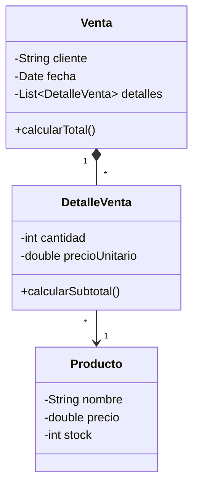

## Contenido del curso de POO 2026-2


```text 

Nombre del curso: Programación Orientada a Objetos (POO) 

Curso orientado a la construcción progresiva de un sistema de escritorio mediante modelado orientado a objetos, interfaz gráfica y persistencia ligera. 

 

Producto del curso: 

Sistema de ventas orientado a objetos con interfaz gráfica en JavaFX, persistencia con base de datos relacional y organización por paquetes o capas para resolver un problema aplicado. 

 

U1: Fundamentos de la Programación Orientada a Objetos 

Producto U1: 

Aplicación funcional en memoria con clases, relaciones entre objetos, colecciones y operaciones principales del dominio. 

S1 - Clases, objetos, atributos, métodos y responsabilidad de clase 

S2 - Encapsulamiento, constructores y control del estado 

S3 - Modelado básico del dominio, asociaciones, composición y colecciones de objetos 

S4 - Herencia, reutilización y polimorfismo aplicado al diseño del sistema 

S5 - CRUD en memoria con ArrayList, búsqueda y ordenamiento 

S6 - Evaluación Unidad 1 

 

U2: Aplicación de escritorio con GUI y base de datos 

Producto U2: 

Aplicación de escritorio funcional con arquitectura por capas, interfaz gráfica en JavaFX y persistencia en base de datos relacional. 

S7 - Arquitectura y Conexión a base de datos relacional con JDBC y SQLite  

S8 - Patrón DAO y operaciones CRUD 

S9 - Interfaz gráfica con JavaFX, formularios, componentes, eventos y navegación entre vistas 

S10 - Registro, consulta, edición y eliminación desde GUI 

S11 - Validación de datos de entrada, integración GUI-lógica-datos y pruebas de flujo principal 

S12 - Evaluación Unidad 2 

 

U3: Proyecto integrador del curso 

Producto U3: 

Integración de U1 y U2 en un sistema completo de escritorio con modelo orientado a objetos, interfaz gráfica, persistencia y organización modular. 

S13 - Desarrollo del proyecto integrador: ensamblaje del modelo, GUI y persistencia 

S14 - Desarrollo del proyecto integrador: manejo de errores, refinamiento del diseño y cierre funcional 

S15 - Documentación, demostración y sustentación del proyecto final 

S16 - Evaluación final del proyecto integrador 
```

## Stack tecnológico propuesto

1. Java como lenguaje orientado a objetos.
2. JavaFX con FXML y MVC para interfaz gráfica y eventos.
3. DAO para persistencia desacoplada.
4. SQLite como base de datos ligera local.
5. Maven para gestión de dependencias y compilación.
6. IntelliJ IDEA para desarrollo y diseño visual en JavaFX.
7. Opcional: GraalVM con GluonFX Maven Plugin para compilación nativa.

## Modelo final



## Estructura base de carpetas

```text
sistema-ventas-poo/
├── pom.xml
├── data/
│   └── ventas.db
└── src/
	└── main/
		├── java/
		│   └── app/
		│       ├── model/
		│       ├── controlador/
		│       ├── dao/
		│       └── util/
		└── resources/
			├── vista/
			├── css/
			└── img/
```