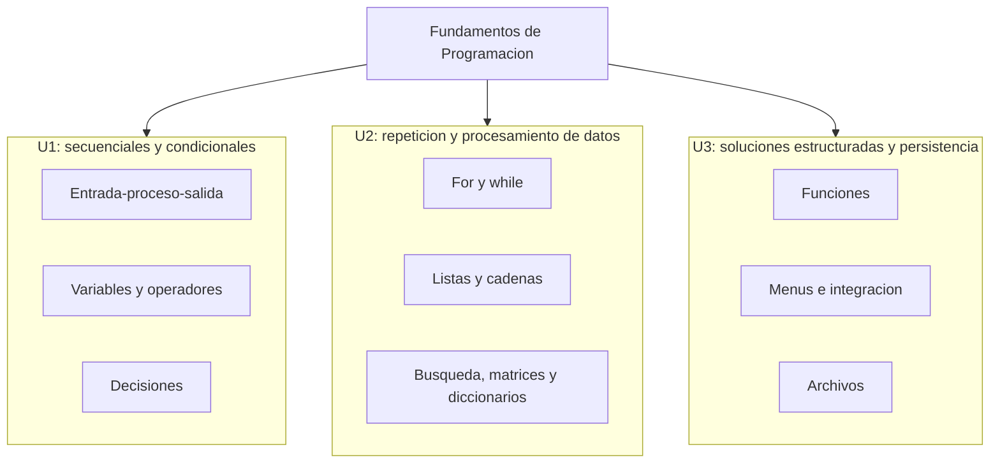

# Fundamentos de Programación 2026

Curso práctico de Fundamentos de Programación orientado al pensamiento algorítmico, entrada-proceso-salida, variables, operadores, decisiones, repeticiones, colecciones, funciones, archivos y explicación técnica de soluciones.

Este libro digital organiza las sesiones del curso para guiar la resolución acumulativa de ejercicios de programación. A diferencia de un curso con proyecto integrador único, FP funciona como un curso de matemática o cálculo: cada sesión aporta ejercicios resueltos, probados y explicados, y el producto final es el compendio ordenado de ese trabajo.

El libro digital es el material guía del curso. El compendio del estudiante se entrega como PDF, reuniendo los problemas desarrollados por sesión con los 6 pasos operativos de resolución.

## Producto del curso

El producto del curso se construye durante todo el semestre:

```text
Compendio final de ejercicios de programación resueltos por sesión,
organizado por unidades, con análisis del problema, código funcional,
pruebas de ejecución, correcciones, explicación de la lógica aplicada
y presentación final en PDF.
```

Resultado esperado del curso:

Al finalizar el curso, el estudiante diseña algoritmos y desarrolla programas básicos en un lenguaje de programación empleando variables, operadores, estructuras condicionales, estructuras repetitivas, listas, funciones y persistencia básica. La evidencia integra comprensión del problema, identificación de entradas, diseño del proceso, generación de salidas, codificación, pruebas y explicación de la solución.

## Contenido

### U1: Estructuras secuenciales y condicionales

Producto U1: compendio parcial de ejercicios resueltos con entrada, proceso, salida, variables, tipos de datos, operadores y estructuras condicionales.

Resultado esperado U1: el estudiante analiza problemas simples, identifica datos de entrada, diseña procesos secuenciales, aplica operadores y construye programas con decisiones simples, múltiples o anidadas.

| Sesión | Tema | Producto de sesión |
|---|---|---|
| S1 | **Pensamiento algorítmico, datos y variables:**<br>Algoritmos, entrada-proceso-salida, lenguaje natural, pseudocódigo, diagrama de flujo, entorno de trabajo, `print()`, `input()`, tipos de datos, variables, constantes y casos de prueba | Programa básico que captura y muestra datos de forma estructurada |
| S2 | **Expresiones y secuencia en la solución de problemas:**<br>Asignación, operadores aritméticos, relacionales y lógicos, expresiones, precedencia, conversión con `int()` y `float()`, estructura secuencial y verificación de resultados | Programas secuenciales que leen datos, realizan cálculos y muestran resultados correctamente formateados |
| S3 | **Decisiones simples en la lógica del programa:**<br>Expresiones condicionales, `if`, `if-else`, condiciones compuestas con `and` y `or`, validación básica de datos y casos de prueba | Programas que responden de manera diferente según las condiciones de entrada |
| S4 | **Decisiones múltiples y lógica anidada:**<br>`if-elif-else`, `match-case`, condicionales anidados, priorización de condiciones, clasificación de datos y casos límite | Programas que clasifican y toman decisiones con varios criterios |
| S5 | **Evaluación de desempeño de la unidad 1:**<br>Variables, operadores, decisiones simples, múltiples o anidadas, `match-case`, entrada-proceso-salida y pruebas con casos normales y límite | Producto U1 validado con procesamiento secuencial y condicional |

### U2: Estructuras repetitivas y procesamiento de datos

Producto U2: compendio parcial de ejercicios resueltos con bucles, validación repetitiva, listas, cadenas, búsqueda, ordenación básica, matrices y diccionarios.

Resultado esperado U2: el estudiante automatiza procesos repetitivos, procesa colecciones de datos, organiza información en estructuras lineales o tabulares y aplica estrategias básicas de búsqueda, conteo, acumulación y transformación.

| Sesión | Tema | Producto de sesión |
|---|---|---|
| S6 | **Repetición definida con `for`:**<br>`for`, `range()`, contadores, acumuladores y sumatorias para repetir acciones un número conocido de veces | Programas que usan `for`, contadores y acumuladores para procesar varios datos |
| S7 | **Repetición condicionada con `while`:**<br>`while`, condición de parada, centinelas, validación iterativa y control de ingreso de datos | Programas con `while`, centinelas y validación iterativa |
| S8 | **Listas, cadenas y procesamiento de colecciones:**<br>Listas, cadenas, recorridos, conteos condicionados y transformación básica de texto | Programas que recorren colecciones, cuentan elementos y transforman información textual |
| S9 | **Búsqueda secuencial y ordenación básica:**<br>Búsqueda secuencial, comparación, intercambio de valores, ordenación básica por intercambio y análisis del proceso | Programas que encuentran elementos y ordenan listas con una estrategia elemental |
| S10 | **Matrices y organización tabular de información:**<br>Matrices, filas, columnas, promedios, totales, consulta, actualización, transpuesta, producto por escalar, producto de matrices e inversa 2x2 | Programas que recorren matrices, obtienen resúmenes o aplican operaciones matriciales básicas |
| S11 | **Diccionarios, organización clave-valor y consulta de datos:**<br>Diccionarios, claves, valores, registro, consulta y actualización de datos | Programas que guardan, consultan y actualizan información con diccionarios |
| S12 | **Evaluación de desempeño de la unidad 2:**<br>`for`, `while`, listas, cadenas, búsqueda, ordenación, matrices, diccionarios, pruebas con casos normales y límite | Producto U2 validado con repetición y procesamiento de datos |

### U3: Problemas estructurados y persistencia básica

Producto U3: compendio parcial de ejercicios con funciones, integración de colecciones, menús y persistencia básica. Esta unidad completa y ordena las evidencias finales del curso, pero no reemplaza el trabajo acumulado de U1 y U2.

Resultado esperado U3: el estudiante organiza sus soluciones en funciones, integra estructuras de datos con flujos de menú, usa archivos para persistencia básica y presenta un compendio final ordenado, probado y explicado.

| Sesión | Tema | Producto de sesión |
|---|---|---|
| S13 | **Funciones, parámetros, retorno y modularización:**<br>`def`, parámetros, `return`, modularización y reutilización de código | Programas organizados en funciones claras que resuelven subproblemas concretos |
| S14 | **Integración de funciones, colecciones y menús:**<br>Menús, funciones con listas o diccionarios, registro, consulta, actualización, salida, coordinación del flujo y pruebas de funcionamiento | Programa modular con menú que registra, consulta o actualiza información en memoria |
| S15 | **Persistencia básica de información:**<br>Persistencia, archivos de texto, escritura, lectura, registro, recuperación y procesamiento básico de información guardada | Programa que escribe datos en un archivo y luego los lee para mostrarlos o procesarlos |
| S16 | **Evaluación final del curso:**<br>Evaluación práctica integradora con funciones, menús, colecciones, persistencia básica, entrada-proceso-salida y compendio trabajado en el curso | Compendio final y evaluación práctica integradora del curso |

## Ruta de trabajo FP 2026

FP no necesita una arquitectura de sistema como POO o Sistemas Distribuidos, porque no desarrolla una aplicación única. El curso usa una ruta común para resolver ejercicios: comprender el enunciado, analizar entrada-proceso-salida, diseñar la solución, codificar, probar, corregir, explicar y registrar la evidencia.

Cada unidad aporta ejercicios propios al compendio final. La relación entre unidades es formativa, no de construcción progresiva de un producto único.

## Mapa de unidades



Este mapa separa las unidades porque cada una tiene un tipo de ejercicio dominante. La relación entre unidades es formativa, no de construcción de un producto único.

## Enfoque pedagógico

El curso adopta un enfoque activo, progresivo y aplicado. En cada sesión se combina explicación breve, modelado del docente, práctica guiada, resolución de retos y cierre con verificación.

La lógica metodológica del curso es:

```text
Comprender -> Diseñar -> Codificar -> Probar -> Explicar -> Mejorar
```

Una sesión eficaz de Fundamentos de Programación debe incluir:

1. Inicio con recuperación de saberes previos y meta de la sesión.
2. Construcción guiada con ejemplos pequeños y modelado paso a paso.
3. Práctica acompañada para modificar, ejecutar y corregir ejemplos.
4. Reto aplicado que exija transferencia y no copia literal.
5. Cierre con retroalimentación, revisión de errores y metacognición.

## Flujo de trabajo

Los 6 pasos operativos que se repetirán en cada sesión son:

1. Comprender el problema.
2. Identificar entradas.
3. Diseñar el proceso.
4. Definir salidas.
5. Casos de prueba.
6. Implementar, ejecutar y corregir.

El ejercicio resuelto y el aprendizaje autónomo de cada sesión se registran como evidencia y se integran al compendio PDF de la unidad.

## Evaluación del aprendizaje

La evaluación es continua, práctica y formativa. En programación inicial no basta verificar si el código corre; también importa si el estudiante comprende el problema, selecciona correctamente las estructuras y prueba su solución.

Criterios generales:

1. Analiza correctamente el problema y distingue entrada, proceso y salida.
2. Usa variables y tipos de datos de forma coherente.
3. Emplea operadores y estructuras de control según el problema.
4. Escribe código legible, ordenado y funcional.
5. Realiza pruebas con datos normales y casos límite básicos.
6. Detecta y corrige errores de sintaxis o lógica simple.
7. Explica verbalmente o por escrito la lógica de su programa.

Evidencias:

1. Guías o cuadernos desarrollados por sesión.
2. Ejercicios resueltos en clase.
3. Retos prácticos individuales o colaborativos.
4. Evaluaciones prácticas por unidad.
5. Compendio PDF de ejercicios resueltos por unidad.
6. Desarrollo de cada problema con los 6 pasos operativos: comprender, entradas, proceso, salidas, casos de prueba e implementación/corrección.

## Recursos

1. Computadora o laptop.
2. Entorno de programación o IDE según el lenguaje seleccionado.
3. Guías o cuadernos de práctica por sesión.
4. Lenguaje de programación definido para el curso.
5. Proyector o pantalla para modelado en vivo.
6. Rúbrica de evaluación práctica.

## Enlaces

- [S1: Algoritmos, datos y variables](S01_Algoritmos_Datos.ipynb)
- [S2: Operadores y algoritmo secuencial](S02_Operadores_Algoritmos_Secuenciales.ipynb)
- [S3: Decisiones](S03_Decisiones.ipynb)
- [S4: Decisiones múltiples](S04_Decisiones_Multiples.ipynb)
- [S5: Evaluación 1](S05_Evaluacion_1.ipynb)
- [S6: Repetición for](S06_For.ipynb)
- [S7: Repetición while](S07_While.ipynb)
- [S8: Listas y cadenas](S08_Listas_Cadenas.ipynb)
- [S9: Búsqueda y ordenación](S09_Busqueda_Ordenacion.ipynb)
- [S10: Matrices](S10_Matrices.ipynb)
- [S11: Diccionarios](S11_Diccionarios.ipynb)
- [S12: Evaluación 2](S12_Evaluacion_2.ipynb)
- [S13: Funciones](S13_Funciones.ipynb)
- [S14: Integración y menús](S14_Integracion_Menus.ipynb)
- [S15: Archivos](S15_Archivos.ipynb)
- [S16: Evaluación final](S16_Evaluacion_Final.ipynb)
- [S0: Guía algoritmo a código](S00_Guia_algoritmo_a_codigo.ipynb)
- [Anexo: Equivalencias Java](S17_Java_Equivalencias.ipynb)
