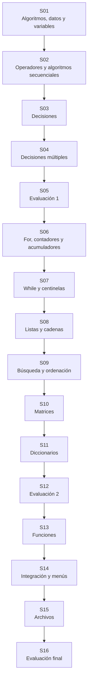

# Libro Digital de Fundamentos de Programación - UPeU

Este repositorio publica el curso como un libro digital orientado a competencias. Cada unidad funciona como un capítulo y cada sesión integra base conceptual, actividad práctica, aprendizaje autónomo y evaluación de cierre.

## Qué encontrará el estudiante

- El sílabo del curso.
- Una guía de apoyo para pasar de algoritmo a código.
- Tres capítulos organizados por competencias.
- Las sesiones con teoría breve, práctica, trabajo autónomo y evaluación.
- Ejemplos y ejercicios presentados como material de lectura y práctica.

## Importante

Este sitio está pensado como libro digital. El contenido se muestra como páginas estáticas; para ejecutar el código, abra los cuadernos en Google Colab o en Jupyter local.

## Ruta de aprendizaje

La competencia central del curso es resolver problemas computacionales básicos de forma ordenada: comprender el problema, identificar datos, diseñar el proceso, programar, probar y explicar la solución.

Durante el curso, el estudiante construirá un compendio de ejercicios resueltos. Cada sesión aporta una parte de esa competencia y prepara la siguiente.

| Tramo | Sesiones | Qué desarrolla el estudiante |
|---|---:|---|
| Problemas básicos | 1-5 | Entrada, proceso, salida, variables, operadores y decisiones. |
| Problemas con varios datos | 6-12 | Repetición, listas, cadenas, búsqueda, ordenación, matrices y diccionarios. |
| Problemas estructurados | 13-16 | Funciones, menús, integración de colecciones y persistencia en archivos. |

## Roadmap del curso

## Sesiones del libro

### Unidad 1: Resolución de problemas básicos

- [Sesión 1: Algoritmos, datos y variables](S01_Algoritmos_Datos.ipynb)
- [Sesión 2: Operadores y algoritmos secuenciales](S02_Operadores_Algoritmos_Secuenciales.ipynb)
- [Sesión 3: Decisiones simples y compuestas](S03_Decisiones.ipynb)
- [Sesión 4: Decisiones múltiples, anidadas y casos límite](S04_Decisiones_Multiples.ipynb)
- [Sesión 5: Evaluación 1](S05_Evaluacion_1.ipynb)

### Unidad 2: Resolución de problemas iterativos y procesamiento de datos

- [Sesión 6: Repetición definida con for](S06_For.ipynb)
- [Sesión 7: Repetición condicionada con while](S07_While.ipynb)
- [Sesión 8: Listas, cadenas y procesamiento de colecciones](S08_Listas_Cadenas.ipynb)
- [Sesión 9: Búsqueda secuencial y ordenación básica](S09_Busqueda_Ordenacion.ipynb)
- [Sesión 10: Matrices y organización tabular de información](S10_Matrices.ipynb)
- [Sesión 11: Diccionarios, organización clave-valor y consulta de datos](S11_Diccionarios.ipynb)
- [Sesión 12: Evaluación 2](S12_Evaluacion_2.ipynb)

### Unidad 3: Resolución de problemas estructurados y persistencia básica

- [Sesión 13: Funciones, parámetros, retorno y modularización](S13_Funciones.ipynb)
- [Sesión 14: Integración de funciones, colecciones y menús](S14_Integracion_Menus.ipynb)
- [Sesión 15: Persistencia básica de información](S15_Archivos.ipynb)
- [Sesión 16: Evaluación final](S16_Evaluacion_Final.ipynb)

## Recomendación de uso

En cada sesión, revise primero la base conceptual, luego desarrolle la actividad práctica, continúe con el aprendizaje autónomo y cierre con la evaluación de la sesión. La secuencia está diseñada para progresar desde problemas básicos hasta soluciones modulares con persistencia elemental.

El objetivo no es memorizar instrucciones aisladas, sino aprender a resolver problemas cada vez más completos. Por eso el curso avanza desde fichas y cálculos simples hasta programas con funciones, colecciones, menús y archivos.
