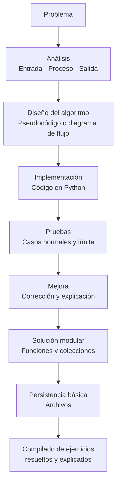

# Libro Digital de Programación

Este repositorio publica el curso como un libro digital orientado a competencias. Cada unidad funciona como un capítulo y cada sesión integra base conceptual, actividad práctica, aprendizaje autónomo y evaluación de cierre.

## Qué encontrará el estudiante

- El sílabo del curso.
- Una guía de apoyo para pasar de algoritmo a código.
- Tres capítulos organizados por competencias.
- Las sesiones con teoría breve, práctica, trabajo autónomo y evaluación.
- Ejemplos y ejercicios presentados como material de lectura y práctica.

## Importante

Este sitio está pensado como libro digital. El contenido se muestra como páginas estáticas y no ejecuta código en el navegador.

## Estructura del libro

- Capítulo 1: resolución de problemas básicos.
- [1 Algoritmos y datos](S01_Algoritmos_Datos.ipynb)
- [2 Operadores y secuencia](S02_Operadores_Secuencia.ipynb)
- [3 Decisiones](S03_Decisiones.ipynb)
- [4 Decisiones múltiples](S04_Decisiones_Multiples.ipynb)
- [5 Evaluación 1](S05_Evaluacion_1.ipynb)
- Capítulo 2: resolución de problemas iterativos y procesamiento de datos.
- [6 Repetición for](S06_For.ipynb)
- [7 Repetición while](S07_While.ipynb)
- [8 Listas y cadenas](S08_Listas_Cadenas.ipynb)
- [9 Búsqueda y ordenación](S09_Busqueda_Ordenacion.ipynb)
- [10 Matrices](S10_Matrices.ipynb)
- [11 Diccionarios](S11_Diccionarios.ipynb)
- [12 Evaluación 2](S12_Evaluacion_2.ipynb)
- Capítulo 3: resolución de problemas estructurados y persistencia básica.
- [13 Funciones](S13_Funciones.ipynb)
- [14 Integración y menús](S14_Integracion_Menus.ipynb)
- [15 Archivos](S15_Archivos.ipynb)
- [16 Evaluación final](S16_Evaluacion_Final.ipynb)

## Recomendación de uso

En cada sesión, revise primero la base conceptual, luego desarrolle la actividad práctica, continúe con el aprendizaje autónomo y cierre con la evaluación de la sesión. La secuencia está diseñada para progresar desde problemas básicos hasta soluciones modulares con persistencia elemental.

